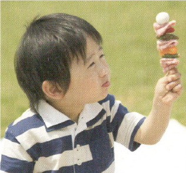
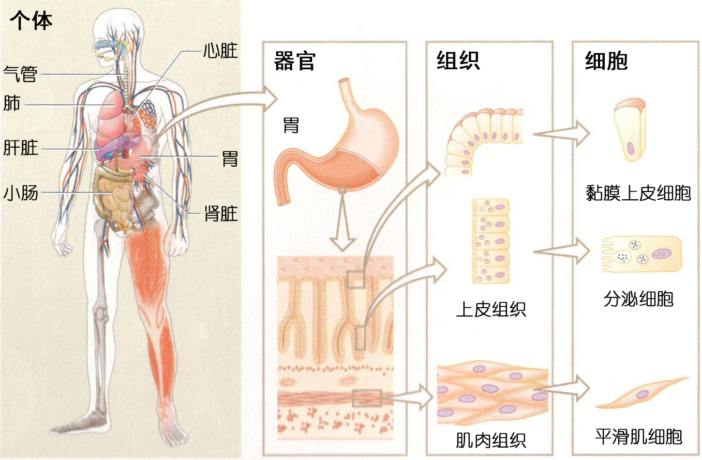
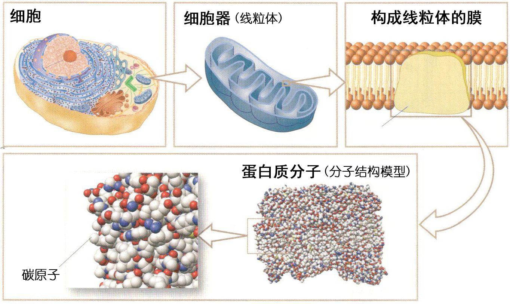
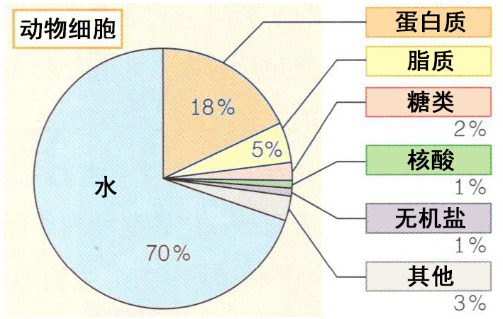
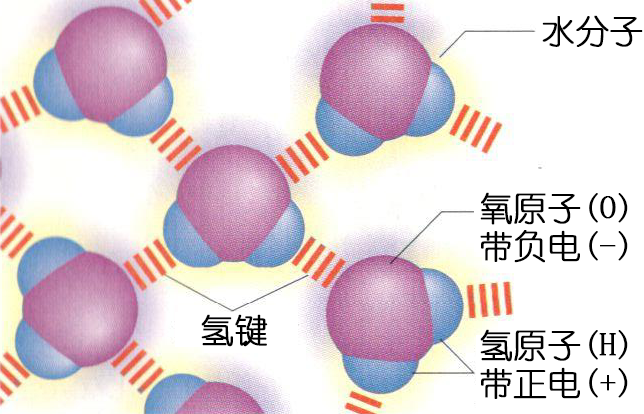
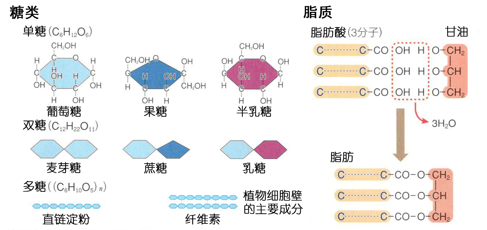

## 第1节  构成生物体的物质

生物由细胞组成，而细胞又是由具有不同性质的物质组成的。为了理解细胞如何构成个体，又是怎样的物质组成的，本节先来学习构成生物体的物质。

 
### 1  生物体的结构与层次

#### A  从细胞到个体

生物个体由 **细胞**组成。人是多细胞生物，同样形状与功能的细胞形成 **组织**[^1]，组织进而形成 **器官**。这些组织和器官相互协调，构成 **个体**维持生命活动（图1）。

[^1]:动物的组织包括覆盖于身体表面的 **上皮组织**、构成肌肉的  **肌肉组织**、连接不同组织并支持生物体的 **结缔组织**、传递信息的 **神经组织**。

例如，细胞的活动需要营养和氧气。小肠等构成的消化系统可以吸收营养，肺等构成的呼吸系统可以获取氧气，通过心脏、血管等构成的循环系统将它们运送到全身各细胞，从而支持细胞的活动。此外，为使各细胞稳定的活动，体内的还必须处在体液当中，肝脏和肾脏等可以将体液的状态保持在一定范围内。
 

#### B  从细胞到分子

另一方面，观察构成生物体的细胞，可以发现线粒体、高尔基体等各种 **细胞器**以及细胞核。许多细胞器都具有两层磷脂分子组成的膜。线粒体由内外两层膜组成，内膜上镶嵌有与呼吸相关的蛋白质分子[^2]，这些蛋白质促使ATP合成。

[^2]:蛋白质是由多个氨基酸组成的，氨基酸是由碳（C）、氢（H）、氧（O）、氮（N）等 **元素**组成的。

像这样，生物体的结构和功能，就可以逐步分解为器官、组织、细胞、细胞器、分子等层次（图1、图2）。
 

### 2  构成细胞的物质

对于大多数生物，构成细胞的物质都是相同的，其中含量最多的是 **水**。除了水以外，还有蛋白质、脂质、糖类等 **有机物**以及 **无机盐**（图3）。
 

表1  构成细胞的物质

|物质|组成元素|特征与功能等|
|水|H、O|作为许多物质的溶剂，运输物质，作为化学反应的场所。|
|蛋白质|C、H、O、N、S|由多个氨基酸组成的高分子化合物。细胞中含量高，是酶、抗体、一些激素的成分。|
|脂质|C、H、O、P|包含磷脂、脂肪等，磷脂是生物膜的成分，脂肪是能源物质。|
|糖类|C、H、O|包括单糖、二糖、多糖等。是生命活动的主要能源物质。|
|核酸|C、H、O、N、P|由糖、碱基、磷酸组成的核苷酸聚合而成。包含DNA和RNA，DNA是遗传物质的载体，RNA参与蛋白质合成。|
|无机盐|Na、K、Cl、Mg等|大多溶于水以离子形式存在，调节体液的浓度和pH，是许多物质的组成成分。|

#### A  水

水（H2O）由氢原子（H）和氧原子（O）依靠共价键构成。如图4所示，H带正电，O带负电，电荷分布不均匀，水分子是极性分子。因此水分子之间的H和O互相吸引，形成较弱的化学键（**氢键**）。
 

由于具有氢键，因此水具有凝聚力较强、比热较大的性质，植物体内水的上升、动物体内避免温度剧烈变化都与水的这种性质相关。
此外，水是良好溶剂，能溶解许多物质[^3]。与水分子同样，具有极性的有机物和金属离子等物质，可以与水分子相互吸引，从而溶于水。水的这种特征，促进许多物质的化学反应，保证生命活动的进行。

[^3]:脂质中，碳原子（C）和氢原子（H）所占比例较高，氧原子（O）的比例很少，因此电荷的分布非常均匀（不具有极性），因此不易溶于水。

#### B  有机物

除了水之外，构成细胞的物质主要是含碳（C）、氢（H）、氧（O）等元素的有机物，包括 **蛋白质**、**核酸**、**脂质**、**糖类**。这些有机物，都是由多个称为单体[^4]的物质组成的化合物（图5）。所有生物的单体都是相同的，因此异养生物可以从其他生物获取，将物质消化（分解）至单体并吸收，然后再细胞内合成所需的有机物。

[^4]:蛋白质、核酸、脂质、糖类的单体分别是氨基酸、核苷酸、脂肪酸与甘油、葡萄糖等单糖。
 

#### C  无机盐

除了水和有机物，还有一些物质是含Na、K、Cl、Mg、Fe等的无机盐。在细胞内外，无机盐主要溶于水以离子形式存在，与肌肉收缩等各种生命活动相关。

 
